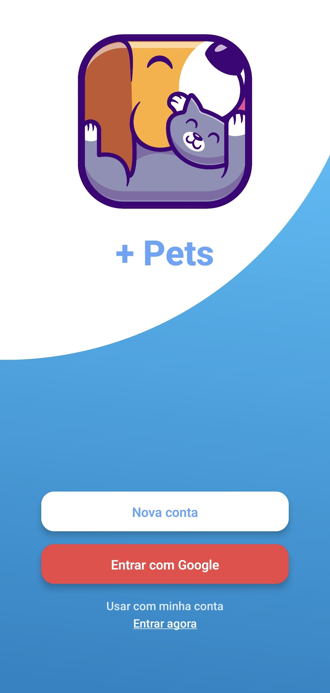

<h2 align="center">
Aplicação mobile sobre Pets
</h2>

<a align="center" href="https://github.com/Pauloricardorc/-pets">
    
  </a>

## Sobre o Projeto

Este projeto mobile foi desenvolvido para ser um app onde pode ser feito uma doação de animais carentes, mais também serve para apoiar organizações que ajudam animais em situações de necessidade.

## O projeto foi desenvolvido em

- [Expo](#https://expo.dev/)
- [NativeWind](#https://www.nativewind.dev/)
- [Lucide Icons](#https://lucide.dev/)
- [React Navigation](#https://reactnavigation.org/)
- [Figma do projeto](#)

### Instalação

1. Para instalar as dependências do projeto, dentro do diretorio que foi clonado basta digitar o seguite comando:

```sh
npm install
```
2. Para executar a aplicação basta executar o comando
```sh	
npx expo start
```

## Contato

Paulo.R.R.C - [Github](https://github.com/Pauloricardorc/-pets) - **paulodev01@gmail.com**